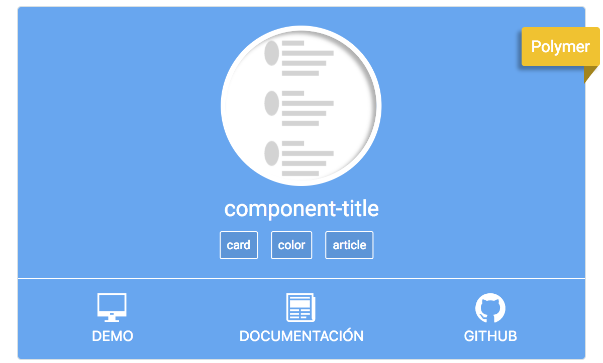
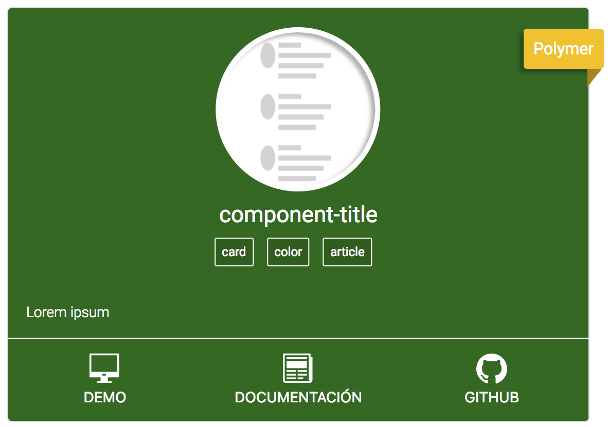
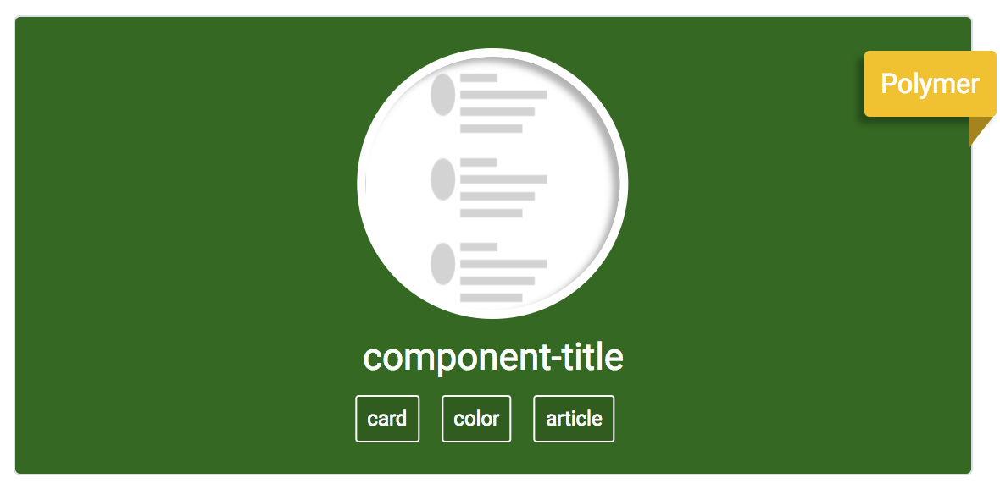
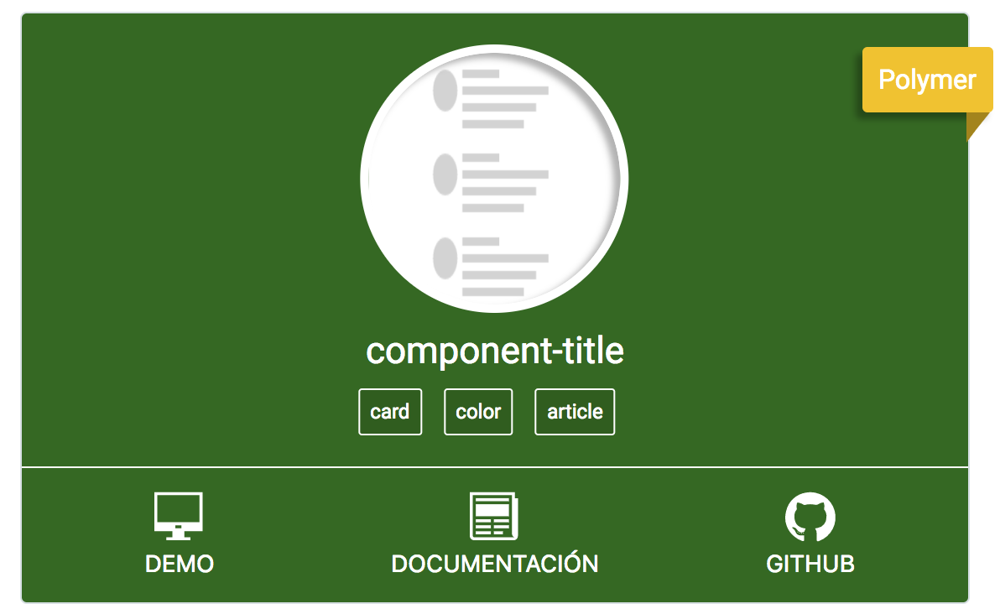
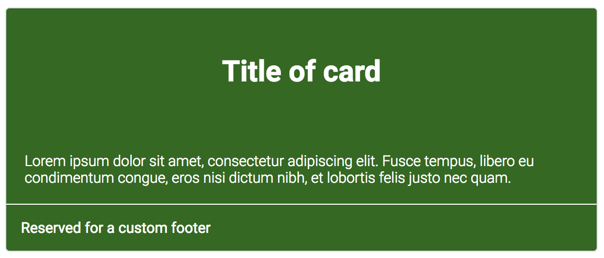

# adom-card-color

__Library:__ Polymer 1.x

__keywords:__ card, color

__Demo:__ [adom-card-color](https://adominguez.github.io/#!/webcomponents/adom-card-color/)

## Description:

This component shows a box with information about a component inside.

The information about this component is:

- name
- description
- color
- image of component
- label
- Webcomponent to show in ribbon

__Basic Example__



```html
<adom-card-color heading="component-title" label='["card", "color"]' img="http://lorempixel.com/150/150" description="lorem ipsum" color="#00897b" webcomponent="polymer"></adom-card-color>
```

__Example without footer__



```html
<adom-card-color heading="component-title" label='["card", "color"]' img="http://lorempixel.com/150/150" description="lorem ipsum" color="#00897b" webcomponent="polymer" no-footer></adom-card-color>
```

__Example collapsed__



```html
<adom-card-color heading="component-title" label='["card", "color"]' img="http://lorempixel.com/150/150" description="lorem ipsum" color="#00897b" webcomponent="polymer" collapsed></adom-card-color>
```

## Slot

This component has three slot for add a customizable content:

Slot | zone |
:--- | :--- |
card-header | header |
card-body | body |
card-footer | footer |

__Example with slot__



```html
<style is="custom-style">
  .card-footer {
    padding: 1em;
  }
</style>
<adom-card-color color="#33691e">
  <div slot="card-header">
    <h1>Title of card</h1>
  </div>
  <div slot="card-body">
    Lorem ipsum dolor sit amet, consectetur adipiscing elit. Fusce tempus, libero eu condimentum congue, eros nisi dictum nibh, et lobortis felis justo nec quam.
  </div>
  <div slot="card-footer">
    <div class="card-footer">
      Reserved for a custom footer
    </div>
  </div>
</adom-card-color>
```

## Methods

this component hasn't got public methods.

## Styling

The following custom CSS properties are available for styling:

Custom property | Description | Default |
:--- | :--- | :--- |
--adom-card-color | empty mixin  | {} |
--adom-card-color-bg-color | background color for :host | #00897b |
--adom-card-color-body | empty mixin for body | {} |
--adom-card-color-body-description | empty mixin for body description | {} |
--adom-card-color-color | color for :host  | #fff |
--adom-card-color-footer | empty mixin for footer | {} |
--adom-card-color-footer-buttons | empty mixin footer buttons | {} |
--adom-card-color-footer-buttons-btn | empty mixin for footer buttons .btn | {} |
--adom-card-color-footer-buttons-btn-color | color for footer buttons .btn  | #fff |
--adom-card-color-footer-buttons-span | empty mixin for buttons span | {} |
--adom-card-color-footer-buttons-svg | empty mixin for buttons svg | {} |
--adom-card-color-footer-buttons-svg-size | size for buttons svg | 30px |
--adom-card-color-header | empty mixin for header | {} |
--adom-card-color-header-container | empty mixin for header container | {} |
--adom-card-color-header-heading | empty mixin for header heading | {} |
--adom-card-color-header-img | empty mixin for header img | {} |
--adom-card-color-header-label | empty mixin for header label | {} |
--adom-card-color-header-size | size for header | 150px |
--adom-card-color-ribbon | empty mixin for ribbon | {} |
--adom-card-color-ribbon-after | empty mixin ribbon after | {} |
--adom-card-color-ribbon-after-bg-color | background color for ribbon after | #A48505 |
--adom-card-color-ribbon-bg-color | color for ribbon | #f1c40f |

## Install

Install the component using [Bower](http://bower.io/):

```bash
$ bower install --save adominguez/adom-card-color
```

## Usage

Import Web Components polyfill:

```html
<script src="bower_components/webcomponentsjs/webcomponents-lite.js"></script>
```

Import Custom Element:

```html
<link rel="import" href="bower_components/adom-card-color/adom-card-color.html"> 
```

## Install in your local machine

Clone the component in your local machine

```bash
$ git clone https://github.com/adominguez/adom-card-color.git
```

```bash
$ cd adom-card-color
```

Install the component using [npm](https://www.npmjs.com/get-npm):

```bash
$ npm install
```

Install the component using [Bower](http://bower.io/):

```bash
$ bower install
```

Serve the component using:

```bash
$ gulp serve
```
